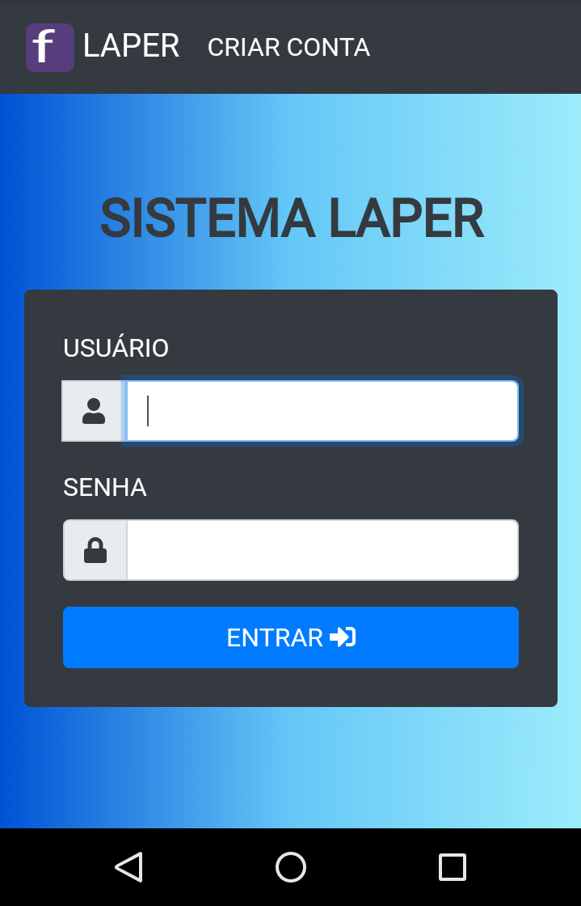
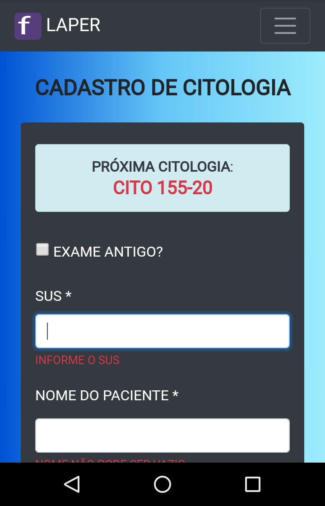
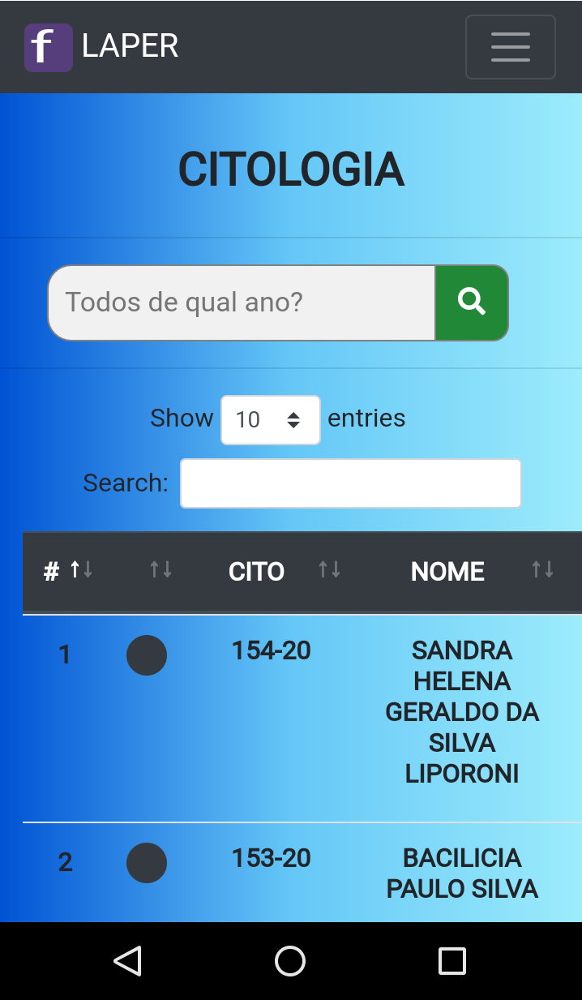
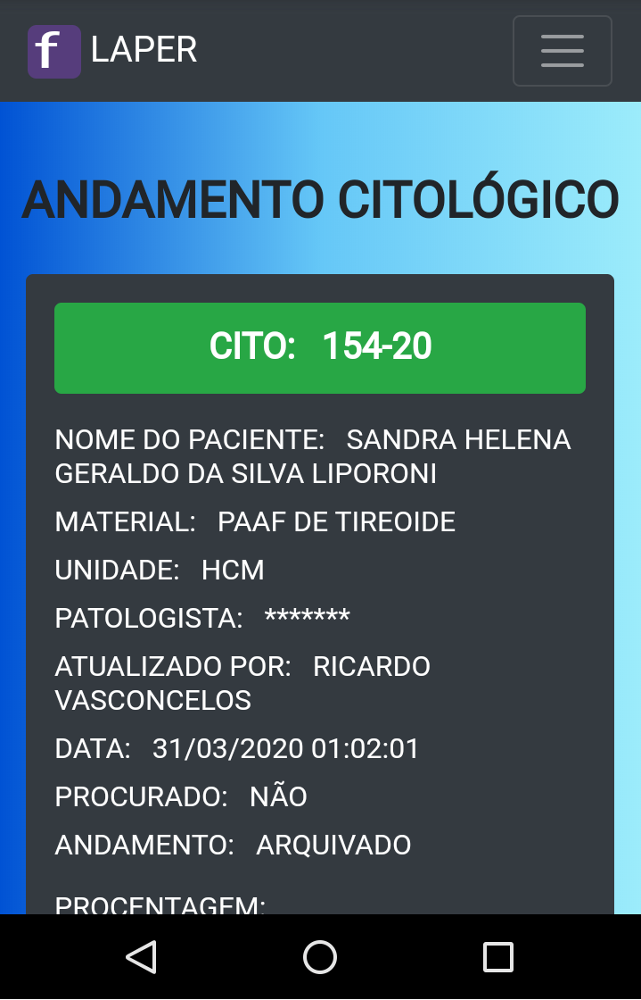
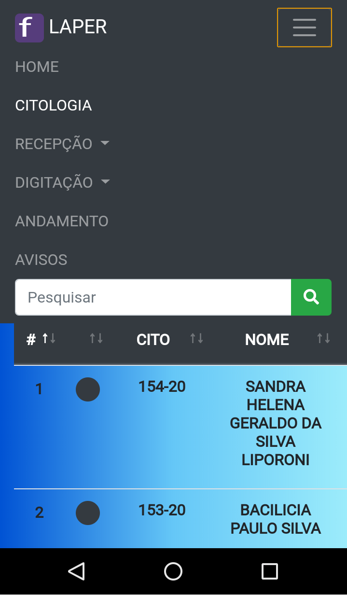
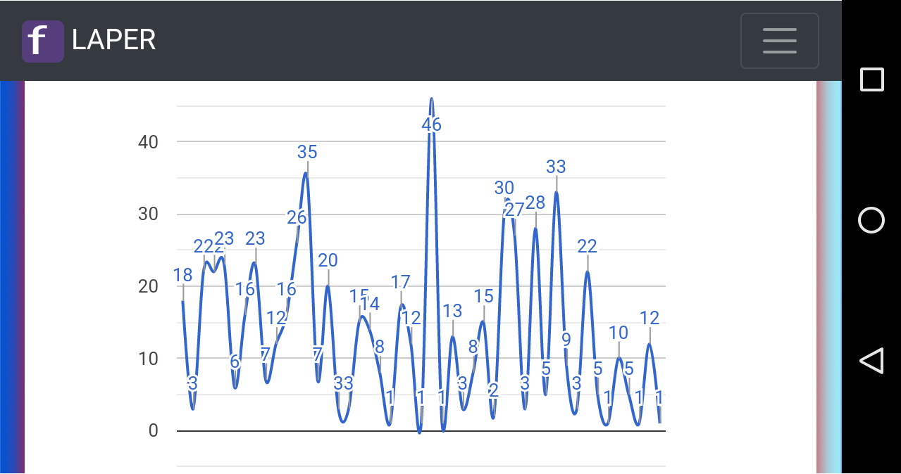

# SISTEMA PARA GERENCIAMENTO DE LABORATÓRIO DE HISTOLOGIA E CITOLOGIA

---
## CONTATO *E-mail*: felipekian@yahoo.com.br
---

Sistema Desenvolvido com PHP7, JQuery, Bootstrap3, CKEditor,....

**Amostra do sistema em execução. Mais imagens ao final.**

---

## OBJETIVOS DO SISTEMA

Gerenciar por completo laboratório de patologia podendo ser implementado também em _seu laboratório_. <b>
sistema em contante evolução e sempre recebendo otimizações de melhoria quando é detectado tal necessidade</b>.

--- 

## GERENCIAR HISTOLOGIA

  1. Cadastro de <b>exames</b> de Histologia.
  2. Gerenciamento de andamento do exame no laboratório em: 
    * <b>Arquivado</b> - exame ainda **não foi separado** para realização dos procedimentos. 
    * <b>Separado</b> - exame retirado do arquivo para **devolução ou clivagem**. 
    * <b>Clivado</b> - exame inicia o procedimento de **macroscopia**. 
    * <b>Processado</b> - exame inicia a etapa de **processamentos nos reagentes químicos**. 
    * <b>Microtomia</b> - exame **encontra-se etapa de microtomia** ( recortar material para ser colocado na lâmina ). 
    * <b>Coloração</b> - exame na lâmina recebe **corantes** especiais. 
    * <b>Microscopia</b> - exame **encontra-se em análise pelo patologista**. 
    * <b>Digitação</b> - exame **encontra-se na sala de digitação**. 
    * <b>Liberado</b> - exame **encontra-se na recepção a espera do paciente vir buscá-lo**. 
    * <b>Entregue</b> - exame **entregue ao paciente**. 
    * <b>Devolvido</b> - exame **devolvido ao paciente** para realizar em outro laboratório. 
   3. Área de busca e listagem dos exames.
   4. Cadastro das Reservas em "caixas" ( Peças que tiveram material em excesso ).
   5. Busca de reservas ou pelas caixas.
   6. Área de Digitação de exames.
   7. Registro de Imuno-histoquímica.
   8. Descarte ( Exames com reserva tem um prazo de 90 dias mínimo para serem descartados após liberação do exame ).
   9. Área para seleção de preças histológicas **arquivadas** para separação para clivagem tendo dados como quantidade de vezes procurado, idade, unidade de saúde, material, quantidade de dias que o exame entrou,....

---

## GERENCIAR CITOLOGIA

  1. Cadastro de <b>exames</b> de Citologia.
  2. Gerenciamento de andamento do exame no laboratório em: 
    * <b>Arquivado</b> - exame ainda **não separado para realização dos procedimentos**. 
    * <b>Separado</b> - exame **saparado para iníciar o processo**.      
    * <b>Coloração</b> - exame na **lâmina recebe corantes especiais**. 
    * <b>Microscopia</b> - exame **encontra-se na sala dos patologistas**. 
    * <b>Digitação</b> - exame tem seu **laudo digitado ou na sala de digitação**. 
    * <b>Liberado</b> - exame **está na recepção** a espera do paciente vir buscar. 
    * <b>Entregue</b> - exame **entregue ao paciente**. 
    * <b>Devolvido</b> - exame devolvido ao paciente para realizar em outro laboratório. 
   3. Área de busca e listagem dos exames.  
   4. Área de Digitação de exames.
   
---

## SCREENSHOTS DO SISTEMA WEB (VERSÃO PC)
   
    
   
      
   
      
   
      
   
      
   
      
   
      
   
      
   
      
   
      
   
      
   
      
   
      
   
      
   
      
   
      
   
      
   
      
   
      
   
      
   
      
   
      
   
   
  
  
---
  
## SCREENSHOTS DO SISTEMA WEB (VERSÃO MOBILE)

   

  
  
  
  
  
 
  
  
  
  
  
  
  
  
  
   
---

### OBRIGADO PELA ATENÇÃO!

### CASO TENHA INTERESSE NESSA OU EM OUTRAS APLICAÇÕES ENTRE EM CONTATO PELO E-mail: **felipekian@yahoo.com.br**
